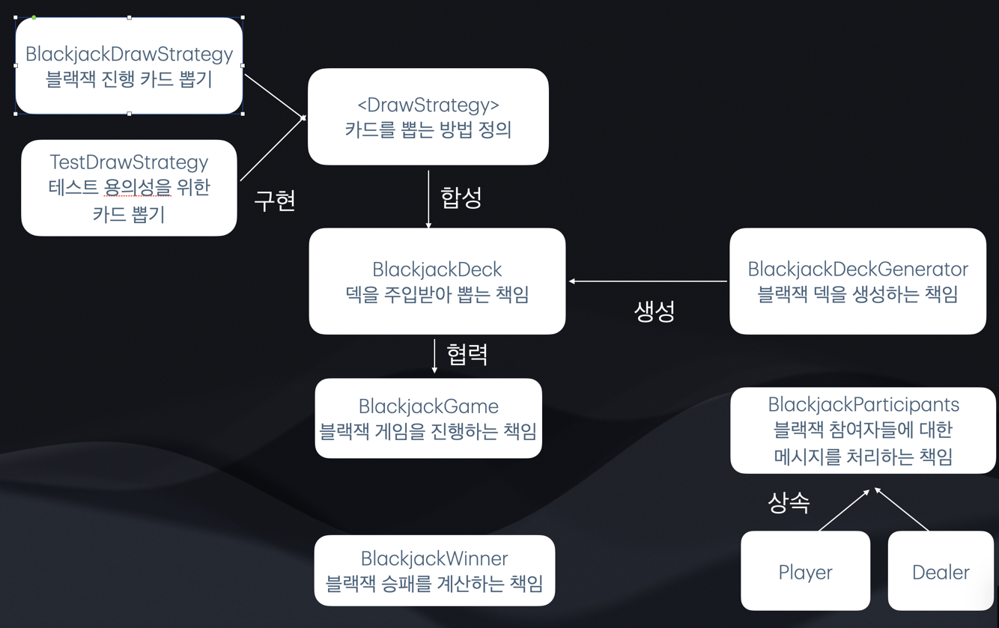

# java-blackjack

# 목표

- 플레이어, 딜러의 중복 코드 제거
- 책임 잘 분배하기(기능을 해치지 않는 선에서 책임과 해야하는 일이 명확한 코드)
- TDD - 요구사항 분석을 잘해서 도메인에 대한 이해는 다 하고 시작.
  (설계를 많이 하겠다는 뜻은 아님)
  최소 단위로 테스트를 작성하면서 더 작은 단위가 나오면 그 테스트를 구현하고, 그러면서도 자연스럽게 설계가 좋게 나오게
  (이번에는 TDD 사이클단위로 커밋을 남기지는 않으려 합니다)
- 시간내에 제출

# 요구사항

- [X] 딜러는 처음에 받은 2장의 합계가 16이하이면 반드시 1장의 카드를 추가로 받아야 하고, 17점 이상이면 추가로 받을 수 없다.
    - [X] 1장의 카드를 받은 뒤에도 16이하인 경우 16 초과가 될때까지 추가로 받는다
- [x] 게임을 시작하면 플레이어는 두 장의 카드를 지급 받으며, 두 장의 카드 숫자를 합쳐 21을 초과하지 않으면서 21에 가깝게 만들면 이긴다. 21을 넘지 않을 경우 원한다면 얼마든지 카드를 계속 뽑을 수
  있다.
    - [X] 카드의 합이 21인 경우에도 더 받을지 묻는다
- [X] 버스트시에는 다시 묻지 않는다
- [x] 게임을 완료한 후 각 플레이어별로 승패를 출력한다.
    - [x] 승 패는 플레이어 vs 딜러인 상황에서 판정한다
    - [x] 무승부인 경우 승과 패 둘다 아닌것으로 계산한다(플레이어에게는 무승부라고 출력됨)

- [x] 플레이어 수는 2-8명으로 제한한다.(딜러포함)
- [X] 카드가 부족하면 예외가 발생한다

- [x] 플레이어는 카드를 받을 수 있다
    - [x] 플레이어는 카드의 합이 21이하인 경우 카드를 받을 수 있다
    - [x] 카드의 합이 21이 넘은 경우 더 이상 받을 수 없다

# 질문

## 캡슐화 vs 중복 코드 제거

이번 미션의 목표로는

- 딜러와 플레이어에서 발생하는 중복 코드를 제거해야 한다. 가 있었습니다.   
  이를 해결하기 위해서 추상클래스로 상속(isA라서 도입해도 된다고 판단)하였고, 일부분 해소되었습니다.
- 그런데 딜러와 플레이어에게 카드를 주는 행위는, 현재 만들어진 책임을 깨지 않는 선에서는잘 해결이 되지 않았습니다.

``` 기존 코드
            blackjackParticipants.addDealerCard(deck.drawCard());
            public void drawCard(String name) {
              blackjackParticipants.addCard(name, deck.drawCard());
            }
```

기존 코드에는 비슷한 객체(플레이어는 이름을 가지고 딜러는 이름을 가지지 않기 때문에)   
임에도 불구하고 추가하는 메서드를 2가지 가지고 있습니다. 위 코드가 중복 코드라고 보고 개선을 해보려고 하였습니다.

```코드 2
public void drawCard(BlackjackPlayer blackjackPlayer) {
  blackjackPlayer.addCard(deck.drawCard());
}
```

위 코드를 생각해보았는데, 위 코드의 경우 외부에서 BlackjackPlayer를 가지고 있게 되어서 blackjackPlayer에 대한 관리까지 이제 외부에서 해야합니다.   
캡슐화가 깨졌다고 생각합니다.

```방법 3```

- DEALER에게 "딜러"라는 식별 이름 부여하여 players 컬렉션에 포함시키기
- 위 방법은 players에 왜 딜러가 있어야하지?라는 의문과 함께,외부에서 "딜러"라는 이름을 통해 내부에서 처리한다는 것을 이해해야하는 단점이 있었습니다.

## 결론

- 위 3가지 방법중 저는 캡슐화가 가장 잘 되어있는 기존 코드를 유지하기로 결정하였습니다.      
  캡슐화라는 가치는 객체지향에서 꽤 높은 우선순위라고 생각하는 편입니다.(책임이 잘 분배되었는지도 판단할 수 있다고 생각합니다)   
  위 부분은 뭔가 구현을 잘해서 해결할 수 있는 방법은 아닌것 같아 리뷰어분에게 꼭
  물어봐야겠다고 생각하였습니다!

## 전략 패턴 도입

- 테스트를 작성하고 성공시키는 과정에서 "어떻게하면 테스트를 제어할 수 있을까? -> 전략 패턴 도입하자"로 의사결정을 하였는데,
  성공 과정에서 테스트를 시키기 위해서 도입한것이 괜찮을지 궁금합니다.
- 전략 패턴에서, validate를 정의함으로써 항상 뽑을때 validate가 동반되어야한다는 것을 인터페이스에서 명시하였는데
  이렇게 동작을 제한하는 것에 대해서 어떻게 생각하시는지 궁금합니다.

## 제네릭 도입 상황

- 카드 List와 Set을 허용하게 하고 싶었는데 remove의 반환형이 달라 List로 형변환해서 사용하는 식으로 구현을 했다
- 이럴때 제네릭을 쓴다면 커스텀해서 사용할 수 있을 것 같은데, 이때 성능은 어쩔수 없이 포기해야하는 부분인지 궁금해요.

## 추상 클래스 도입

- 추상 클래스는 단순 중복 코드 제거를 위해서 도입했을때 결합도가 높아지는 단점이 있는 것으로 알고 있는데,
  이번 추상 클래스를 도입하게 된 상황은 완전히 딜러와 플레이어가 블랙잭플레이어라는 그룹안에서 완전히 isA라고 생각하여서 도입하였는데
  이 경우에는 추상 클래스 도입시에 결합도 단점은 없어보이는데 어떻게 생각하시나요?
- 추상 클래스나 상속같은 관계에서 테스트가 중복이 될 것 같은데 이번에는 테스트가 설계서라는 측면에서 둘다 동일한 동작을 보증하기 위해 테스트를 중복되게 작성을 했는데,
  이러면 테스트에서는 중복코드가 생기는 것이 마음에 걸렸는데, 이 부분 어떻게 테스트 진행해야 효율적일지 궁금해요

## 방어적 api 설계

- 일반적인 흐름상에서는 문제가없지만 방어적으로 api를 설계하려고 했다 (drawStrategy가 실제 게임상에서는 deck이 빌 일이 없지만 그에 대한 예외처리를 구현함)
  일반적인 흐름상에서만 로직을 생각하는것과 방어적으로 설계할때무조건 방어적 설계 하는게 좋다고 생각되는데 어떻게 생각하시는지?   
  ex)

```
public TrumpCard dealerCardFirst() {
        return dealerCards().get(0);
    }
```

위 코드의 경우 생성자를 거치는 순간부터 항상 카드가 비어있는 순간이 없습니다.
그런데 의도를 좀 더 확실히하기위해 예외 처리를 추가하는것이 좋을까요?

## 테스트에 있어서 협력 관계에 있는 코드를 사용하는 것이 좋은지 아니면 계층을 최소화해서 테스트 하는것이 좋은지 궁금합니다.

```
    @Test
    void 블랙잭_승패_계산() {
        Deque<TrumpCard> trumpCards = new LinkedList<>(
                List.of(new TrumpCard(Suit.DIAMOND, CardValue.EIGHT), new TrumpCard(Suit.DIAMOND, CardValue.J),
                        new TrumpCard(Suit.HEART, CardValue.K), new TrumpCard(Suit.HEART, CardValue.NINE),
                        new TrumpCard(Suit.CLOVER, CardValue.EIGHT), new TrumpCard(Suit.CLOVER, CardValue.J)));
        Deck deck = new Deck(new BlackjackDeckGenerator(), new TestDrawStrategy(trumpCards));
        Dealer dealer = new Dealer();
        List<String> names = List.of("포비", "루키");
        BlackjackGame blackjackGame = new BlackjackGame(names, deck, dealer);
        BlackjackResult blackjackDealerResult = blackjackGame.currentDealerBlackjackResult();
        List<BlackjackResult> blackjackPlayerResults = blackjackGame.currentPlayerBlackjackResult();
        BlackjackWinner blackjackWinner = new BlackjackWinner(blackjackDealerResult, blackjackPlayerResults);

        assertThat(blackjackWinner.getDealerWinStatus())
                .isEqualTo(new DealerWinStatus(0, 1));
        assertThat(blackjackWinner.getPlayerWinStatuses().get("포비"))
                .isEqualTo(WinStatus.DRAW);
        assertThat(blackjackWinner.getPlayerWinStatuses().get("루키"))
                .isEqualTo(WinStatus.WIN);
    }
    
    위 코드는 Deck으로부터 카드를 받아와서 승패를 계산하는 로직을 내포하고 있습니다.
    그런데 위 코드에서 Deck이 연관되는 방식과,
    Deck 없이 BlackjackResult를 직접 만들어서 테스트 하는 방식 어느 방식이 더 나을지 궁금합니다.
    기존의 코드를 사용하는 점에서는 전자 방식이 더 매력적이라고 생각됩니다.
    
```

## 각 객체들이 모두 협력이 잘 되었을때는 동작이 문제가 없음 그러나 각각 객체만으로는 블랙잭 상태가 엄밀하지 않다. 이부분까지 고려해서 방어적으로 설계해야하는지

# 협력 관계




